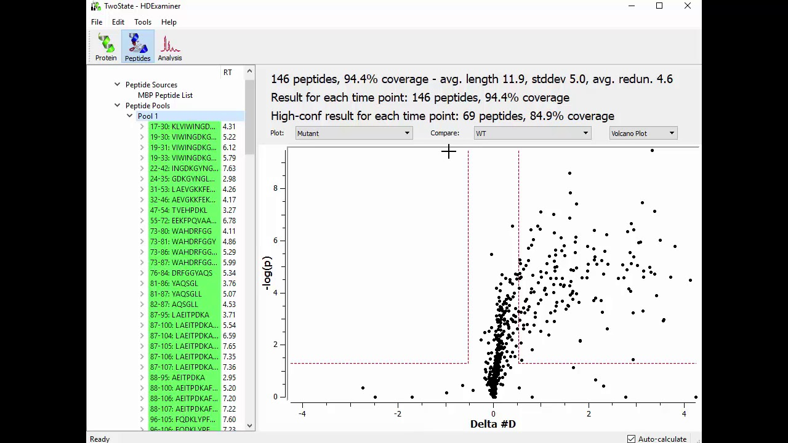

```{r setup, include=FALSE}
knitr::opts_chunk$set(echo = FALSE)

library(HaDeX)
library(dplyr)
library(ggplot2)
library(tidyr)

dat <- read_hdx(system.file(package = "HaDeX", "HaDeX/data/KD_180110_CD160_HVEM.csv"))

```

# Solutions existing in other softwares

Description and example plot for already existing types of plots.
All of the plots are generated using our example datafile - KD_180110_CD160_HVEM.csv.
Since the purpose of this document is to show the plot types, the examples are focused on experimental data. Plots using theoretical calculations should look analogous.

## Butterfly plot

This plot shows the deuterium uptake values as points for each peptide (in order) for all time points at once. There is no association with the position of the sequence or the peptide length.

I don't know yet how to include here the uncertainty. As a ribbon? Feedback needed.

```{r}

times <- unique(dat[["Exposure"]])[3:7]

butterfly_plot_dat <- lapply(times, function(t){
  
  calculate_state_deuteration(dat, protein = "db_CD160", state = "CD160",
                              time_0 = 0.001, time_t = t, time_100 = 1440.000) %>%
    arrange(Start, End) %>%
    mutate(ID = 1L:nrow(.),
           Exposure = factor(t)) %>%
    select(ID, Exposure, everything()) 
  
}) %>% bind_rows()

```

This is the proposed butterfly plot for the fractional deuterium uptake.

```{r}
ggplot(butterfly_plot_dat, aes(x = ID, y = frac_deut_uptake, color = Exposure)) + 
  geom_point() + 
  geom_line(aes(group = Exposure, color = Exposure)) +
  coord_cartesian(ylim = c(0, 100)) +
  labs(title = "Butterfly plot",
       x = "Peptide ID",
       y = "Fractional deuterium uptake [%]") +
  theme(legend.position = "bottom")
```

This is the proposed butterfly plot for the deuterium uptake.

```{r}

ggplot(butterfly_plot_dat, aes(x = ID, y = deut_uptake, color = Exposure)) + 
  geom_point() + 
  geom_line(aes(group = Exposure, color = Exposure)) +
  coord_cartesian(ylim = c(0, 20)) +
  labs(title = "Butterfly plot",
       x = "Peptide ID",
       y = "Deuterium uptake [Da]") +
  theme(legend.position = "bottom")
```

## Vulcano plot


There is an [article](https://pubs.acs.org/doi/10.1021/acs.analchem.9b01325) dedicate to statistical testing of vulcano plot. 

Not entirely sure yet how this plot is produced. It looks like there is a p-value calculated for each deuterium uptake value, but I'm looking for a precise description (e.q. how the p-value is calculated. I think it is a t-Student test but would be nice to have some citations). I hope it is not the "it is so common we don't have to describe it so go guess yourself" case.

Below there is an example vulcano plot from HDeXaminer (from their instructional video).



# My ideas for new features

## Woods plot to butterfly plot

So I want to show the differential values but in the butterfly form for all timepoints. I have doubts if this is readable. What do you think?

```{r}
times <- unique(dat[["Exposure"]])[3:7]

butterfly_woods_plot_dat <- lapply(times, function(t){
  
  generate_differential_data_set(dat = dat, states = c("CD160", "CD160_HVEM"), protein = "db_CD160", 
                                 time_0 = 0.001, time_t = t, time_100 = 1440.000) %>%
    arrange(Start, End) %>%
    mutate(ID = 1L:nrow(.),
           Exposure = factor(t)) %>%
    select(ID, Exposure, everything()) 
  
}) %>% bind_rows()

```

There is a differential butterfly plot for differences in fractional deuterium uptake.

```{r}
ggplot(butterfly_woods_plot_dat, aes(x = ID, y = diff_frac_deut_uptake, color = Exposure)) + 
  geom_point() + 
  geom_line(aes(group = Exposure, color = Exposure)) +
  coord_cartesian(ylim = c(-10, 20)) +
  labs(title = "Butterfly differential plot",
       x = "Peptide ID",
       y = "Delta Fractional deuterium uptake [%]") +
  theme(legend.position = "bottom")
```

There is a differential butterfly plot for differences in deuterium uptake.

```{r}
ggplot(butterfly_woods_plot_dat, aes(x = ID, y = diff_deut_uptake, color = Exposure)) + 
  geom_point() + 
  geom_line(aes(group = Exposure, color = Exposure)) +
  coord_cartesian(ylim = c(-.5, 1)) +
  labs(title = "Butterfly differential plot",
       x = "Peptide ID",
       y = "Delta deuterium uptake [Da]") +
  theme(legend.position = "bottom")
```

## Comparison plot - but for the different time points

Ok, so this is the comparison plot - but the comparison is not between states but between the time points for given state. The chosen state is well-visible, the other states are blurred.

```{r}
compare_all_plot_dat <-  butterfly_plot_dat %>%
  mutate(alpha = case_when(
    Exposure == 5 ~ 1,
    TRUE ~ 0.8
  ))
```

This is the proposed comparison plot for the fractional deuterium uptake.

```{r}

ggplot(compare_all_plot_dat) +
  geom_segment(aes(x = Start, xend = End, y = frac_deut_uptake, yend = frac_deut_uptake, color = Exposure, alpha = alpha)) +
  geom_errorbar(aes(x = Med_Sequence, ymin = frac_deut_uptake - err_frac_deut_uptake, ymax = frac_deut_uptake + err_frac_deut_uptake, alpha = alpha, color = Exposure)) + 
  coord_cartesian(ylim = c(0, 100)) + 
  labs(title = "Compare values for time points", 
       x = "Position in sequence", 
       y = "Fractional deuterium uptake [%]") + 
  scale_alpha(guide = 'none') + 
  theme(legend.position = "bottom")

```

This is the proposed comparison plot for the deuterium uptake.

```{r}

ggplot(compare_all_plot_dat) +
  geom_segment(aes(x = Start, xend = End, y = deut_uptake, yend = deut_uptake, color = Exposure, alpha = alpha)) +
  geom_errorbar(aes(x = Med_Sequence, ymin = deut_uptake - err_deut_uptake, ymax = deut_uptake + err_deut_uptake, alpha = alpha, color = Exposure)) + 
  coord_cartesian(ylim = c(0, 20)) + 
  labs(title = "Compare values for time points", 
       x = "Position in sequence", 
       y = "Deuterium uptake [Da]") + 
  scale_alpha(guide = 'none') + 
  theme(legend.position = "bottom")

```


## Kinetics - theoretical & experimental 

In this plot we can see compared experimental and theoretical calculations for given peptide in given state.
Theoretical calculations are in dashed linetype.

For the INITSSASQEGTRLN peptide:

```{r}

kinetic_dat <- calculate_kinetics(dat, 
                   protein = "db_CD160",
                   sequence = "INITSSASQEGTRLN", 
                   state = "CD160",
                   start = 1, 
                   end = 15,
                   time_0 = 0.001, 
                   time_100 = 1440)

kinetic_dat %>% 
  mutate(prop = paste0(Sequence, "-", State)) %>%
  ggplot(aes(x = time_chosen)) +
  scale_x_log10() +
  geom_point(aes(y = frac_deut_uptake, group = prop)) + 
  geom_point(aes(y = theo_frac_deut_uptake, group = prop)) +
  geom_ribbon(aes(ymin = frac_deut_uptake - err_frac_deut_uptake, ymax = frac_deut_uptake + err_frac_deut_uptake, fill = prop), alpha = 0.15) +
  geom_line(aes(y = frac_deut_uptake, color = prop)) +
  geom_line(aes(y = theo_frac_deut_uptake, color = prop), linetype = 2) +
  geom_ribbon(aes(ymin = theo_frac_deut_uptake, ymax = frac_deut_uptake, fill = prop), alpha = 0.25) + 
  scale_y_continuous(limits = c(0, 110)) + 
  scale_linetype("Calculations", breaks = c("Experimental", "Theoretical")) +
  theme(legend.position = "bottom",
        legend.title = element_blank()) +
  labs(x = "Time points [min]", 
       y = "Fractional deuterium uptake [%]")

```

For the FTISQ  peptide:

```{r}

kinetic_dat <- calculate_kinetics(dat, 
                   protein = "db_CD160",
                   sequence = "FTISQ", 
                   state = "CD160",
                   start = 71, 
                   end = 75,
                   time_0 = 0.001, 
                   time_100 = 1440)

kinetic_dat %>% 
  mutate(prop = paste0(Sequence, "-", State)) %>%
  ggplot(aes(x = time_chosen)) +
  scale_x_log10() +
  geom_point(aes(y = frac_deut_uptake, group = prop)) + 
  geom_point(aes(y = theo_frac_deut_uptake, group = prop)) +
  geom_ribbon(aes(ymin = frac_deut_uptake - err_frac_deut_uptake, ymax = frac_deut_uptake + err_frac_deut_uptake, fill = prop), alpha = 0.15) +
  geom_line(aes(y = frac_deut_uptake, color = prop)) +
  geom_line(aes(y = theo_frac_deut_uptake, color = prop), linetype = 2) +
  geom_ribbon(aes(ymin = theo_frac_deut_uptake, ymax = frac_deut_uptake, fill = prop), alpha = 0.25) + 
  scale_y_continuous(limits = c(0, 110)) + 
  scale_linetype("Calculations", breaks = c("Experimental", "Theoretical")) +
  theme(legend.position = "bottom",
        legend.title = element_blank()) +
  labs(x = "Time points [min]", 
       y = "Fractional deuterium uptake [%]")

```


## Prof suggests


Additionally, there is an old idea from professor, to calculate mean intensity difference between states for peptide in given time point and for all time points combined.

```{r}
dat %>%
  select(Sequence, State, Start, End, Exposure, Inten) %>%
  group_by(Sequence, State, Start, Exposure, End) %>%
  mutate(mean_inten = mean(Inten),
         err_mean_inten = sd(Inten)) %>%
  select(-Inten) %>%
  arrange(Start) %>%
  unique(.) %>%
  gather(key = "type", 
         value = "value", 
         mean_inten:err_mean_inten) %>%
  unite(col = "type",
        State, type, sep = "_") %>%
  spread(key = "type", 
         value = "value") %>%
  mutate(ratio = CD160_mean_inten / CD160_HVEM_mean_inten,
         err_ratio = sqrt((CD160_err_mean_inten^2/(CD160_HVEM_mean_inten^2))^2 + ((CD160_mean_inten^2*CD160_HVEM_err_mean_inten^2)/(CD160_HVEM_mean_inten^4))^2),
         Med_Sequence = (Start + End)/2) %>%
  ggplot() + 
    geom_segment(aes(x = Start, y = ratio, xend = End, yend = ratio, color = factor(Exposure))) +
    labs(x = "Position in sequence",
         y = "Intensivity in state_1 to state_2 ratio") + 
    facet_wrap(Exposure ~ . )
```

And for all time points combined:

```{r}
dat %>%
   select(Sequence, State, Start, End, Inten) %>%
   group_by(Sequence, State, Start, End) %>%
   mutate(mean_inten = mean(Inten),
          err_mean_inten = sd(Inten)) %>%
   select(-Inten) %>%
   arrange(Start) %>%
   unique(.) %>%
   gather(key = "type", 
          value = "value", 
          mean_inten:err_mean_inten) %>%
   unite(col = "type",
         State, type, sep = "_") %>%
   spread(key = "type", 
          value = "value") %>%
   mutate(ratio = CD160_mean_inten / CD160_HVEM_mean_inten,
          err_ratio = sqrt((CD160_err_mean_inten^2/(CD160_HVEM_mean_inten^2))^2 + ((CD160_mean_inten^2*CD160_HVEM_err_mean_inten^2)/(CD160_HVEM_mean_inten^4))^2),
          Med_Sequence = (Start + End)/2) %>%
   ggplot() + 
     geom_segment(aes(x = Start, y = ratio, xend = End, yend = ratio)) +
     labs(x = "Position in sequence",
          y = "Intensivity in state_1 to state_2 ratio") 
         
```

